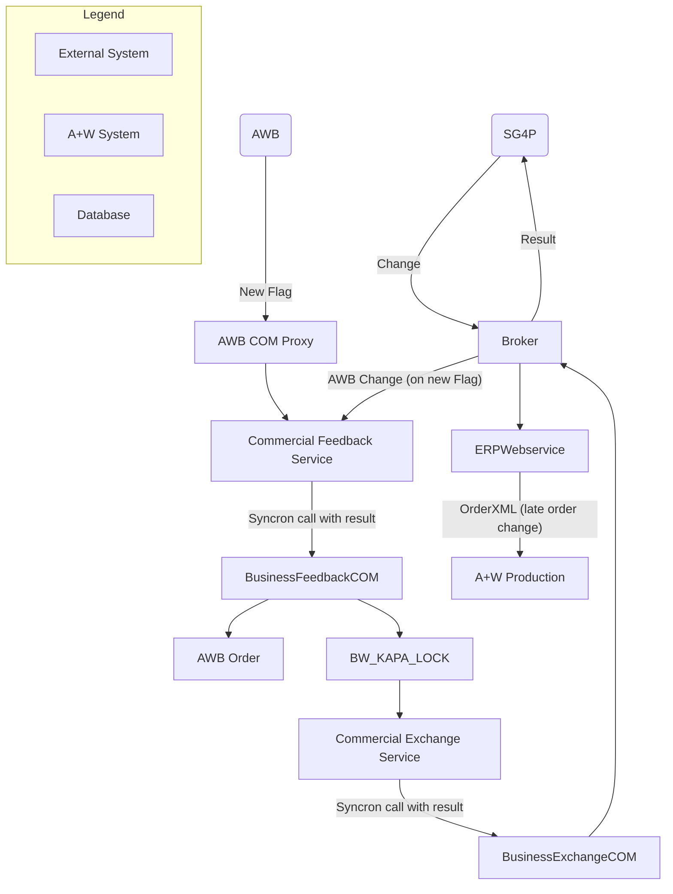
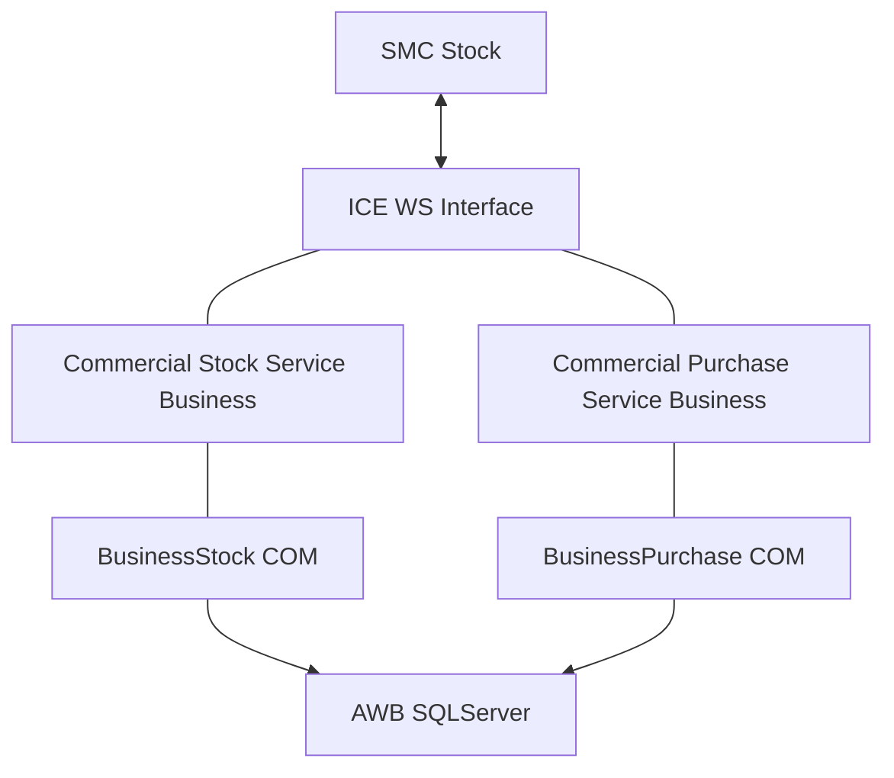

---
## 24.2.2. Infrastructure configuration

In the infrastructure configuration, the MQTT client must be activated and configured for the feedback service.

The host must be adjusted and the user entered with his password.

The "subscribe" entry can be made so that there is a reaction to all messages for this site that come from the customer. For multi-sites, the site number is always important.

**Example:** `Feedback/<Site number>/+/<Customer abbreviation>/act`

How the customer sets these topics must be clarified with him.

How we can pass along the delivery date change can now be set in the next field.

**Example:** `Feedback/<Site number>/deliverydateupdate/aw/act`

**UI Configuration (System > Parameter > MQTT Broker):**
*   **Feedback Service für MQTT aktivieren:** This checkbox must be enabled to activate the service.

## 24.2.3. Testing and monitoring

With the MQTT Explorer, the delivery date change can be simulated; for this, the topic listed below must be published. The payload must be adjusted.

**UI Configuration (Infrastructure > Mqtt > MqttSettingCommercialFeedback):**
*   **Activate MQTT:** ON
*   **MQTT Broker Host:** e.g., `DL-DEV19`
*   **MQTT Broker Port:** e.g., `1883`
*   **Subscribed MQTT Topics:** `Feedback/001/+/sg4p/act`
*   **Publish Delivery Date Update MQTT Topic:** `Feedback/001/deliverydateupdate/aw/act`

**Testing with MQTT Explorer:**

*   **TOPIC:** `Feedback/001/deliverydateupdate/sg4p/act`
*   **PAYLOAD:**
    ```json
    {
      "Action": "DeliveryDateUpdate",
      "Order": "270955",
      "DeliveryDate": "2022-01-26",
      "PrimaryReason": "2- Problème Commercial",
      "SecondaryReason": "Not available",
      "Comment": "Notify to subscriber about new Delivery Date",
      "Person": "SYSADM"
    }
    ```
The delivery date change can also be monitored here.

## 24.3. Basic knowledge

After the installation and activation of "Activate MQTT" for MQTT Commercial Feedback, the service includes a topic `Feedback/+/+/+/act`, that is, the service is subscribed to and hears every published message that contains "Feedback/.../.../.../act", whereby the symbol `+` replaces each word after `/`.

The topic is very useful if the customer has more than one instance of the service and would like to break down the service, e.g. in multisite mode where each site can have its own topic.

For example, a company with two locations:
*   1724 - North Subsidiary
*   1725 - South Subsidiary

The configuration of the feedback service for the site 1724 should look approximately like this:
- `Feedback/1724/+/+/act`
The instance of the service 1724 receives only the messages published for the site 1724.

The configuration of the feedback service for the site 1725 should look approximately like this:
- `Feedback/1725/+/+/act`
The instance of the service 1725 receives only the messages published for the site 1725.

### 24.3.1. MQTT Topics

MQTT topics are a form of addressing that allows MQTT clients to exchange information.
MQTT topics are structured in a hierarchy similar to folders and files in a file system, whereby the slash (/) is used as a separator.
With this system, you can create a user-friendly and self-describing name structure of your choice.

**Topic names are:**
- Capitalization (same name with capital letters is different)
  `"Feedback/Site/..."` is different than `"feedback/Site/..."`
- Use UTF-8 character strings.
- They must consist of at least one character in order to be valid.

With the exception of the $SYS topic, there is no default or default topic structure. This means that there are no topics that are created by default on a broker, with the exception of the $SYS topic.

All topics are created by a subscribing or publishing client and are not permanent.
A topic only exists if a customer has subscribed to it or a broker has saved an archived or last message for this topic.

### 24.3.2. Subscribing to topics

A customer can subscribe to one or several topics.
When subscribing to several topics, two placeholder characters can be used.

These are:
- **`#` (number sign)** - multi-level placeholder
- **`+` (plus sign)** - placeholder for a level

Placeholders can only be used to designate a level or several levels, e.g. `/site/#` and not as part of the name in order to designate several characters, e.g. `sit#` is not valid.

**Examples for the naming of topics:**

**Valid topic subscriptions**
Individual topic subscriptions
- `/`
- `/Site`
- `Site/Room/Main light`
- `Site/Room/Sidelight`

**Using topic wildcards**
Subscribing to the topic `site/#`
Covers:
- `Site/Room1/Main light`
- `Site/Room1/Alarm`
- `Site/Garage/Main light`
- `Site/Main door`
- etc...

Example for a subscription to the topic `Site/+/Main light`
Covers:
- `Site/Room1/Main light`
- `Site/Room2/Main light`
- `Site/Garage/Main light`
Does not cover:
- `Site/Room1/Sidelight`
- `Site/Room2/Sidelight`

**Invalid topic subscriptions**
- `Site+ground`: no topic level
- `Site#ground`: no topic level

## 24.4. Delivery date update

SG4P sends a delivery date update to the broker, which forwards it to the report service, and the change is entered via the BusinessFedbackCOM in the `FS_POOL_KOPF/FS_POOL` database table; that is, it is stored temporarily. A method `udf_SGGDeliveryDateUpdate()` has been developed, which processes these entries; that is, the order is locked, the delivery date is changed, and if necessary, the entry is made in `BW_LOCK_KAPA` for the late change in the production. In the directory `....\A+W\Business 6\Formula\MQTT\` there is a template for a workflow in order to be able to execute the delivery date update via commercial exchange service. If there is an error during processing, it can be communicated to the user via e-mail. If, for example, the document is locked, the data record in `FS_POOL_KOPF` receives the status `STATUS_GESPERRT (3)` and can thus be processed again during the next run through the workflow. All other error cases run on the status `STATUS_FEHLER (2)` and must be reset for renewed processing with `udf_ResetErrorRecords()`.

The Exchange Service processes the late production change and creates a production transfer in the ERP Web service. The reporting is done asynchronously via the production to the ERP Web service, but is not reported to SG4P. Problems must be processed by the user. Already at the beginning of the change, it can happen that the order cannot be locked; then the function returns an error and sets the status accordingly as described above.

Furthermore, a new company option **"Shift of delivery date into the past permitted"** was implemented. This is coupled to the A+W Production capacity planning. With an activated option, a change transfer is also initiated for delivery date shifts into the past.

In order to use the same function in A+W Business and A+W Production, the following switches should be activated:

**A+W Business Configuration (Company > Parameter > Capacity planning):**
*   **A+W Production-Delivery date postponement:** Check `Allow postponement of delivery dates into the past`.

**A+W Production Configuration (Parameter administrator > A+W Production > General):**
*   **Allow postponement of delivery days in the past:** Set value to `1`.
    *   **0:** The current point of time would be the earliest accepted delivery date.
    *   **1:** Each delivery date will be accepted.

### Process Flow for Delivery Date Change


**Description of Flow:**
1.  A change of the delivery date in A+W Business (order entry, document data) informs the Feedback Service.
2.  The Feedback Service reports the delivery date change via the broker to the SG4P. This change is considered accepted.
3.  Simultaneously, `BW_KAPA_LOCK` is populated with a new ID.
4.  This triggers the trade exchange service in the workflow to inform the return service about the change.
5.  The return service forwards the change via the broker back to SG4P without processing a result.

### 24.4.1. Delivery date update in A+W Business

With this function, AWB informs the Feedback Service and the broker about changed delivery dates in AWB. This only happens if the company option for this method is enabled to report the change to the broker. This function is only triggered if the order status is greater than or equal to the defined status in the company data.

### 24.4.2. MQTT Topic 4 expansion of dispatch

In the company data, on the tab **14.Dispatch**, there are now two new options: **Topic 4 - Dispatch** and **Topic 5 - Delivery**, which you can activate if the Feedback Service for MQTT is activated. However, you can only activate one of these options because the processing runs the same way.

The functionality for **Topic 5 - Delivery** was already implemented. The processing of dispatch data is new. This involves reporting order data, item quantities, and the rack information for order items.

- If the reported item quantity is not equal to the original quantity, a partial delivery is generated automatically and placed on the reported rack.
- If the reported quantity is complete, no partial delivery has to be generated; the order item is only assigned to the rack.

To exclude surcharge items from the determination of the item quantity, a new option in the production types has been implemented for control.

## 25. SGG Integration Allianz Trade (Euler/Hermes) Restful API

Via the AWSOA Commercial Exchange Service, a communication interface to the Allianz Trade System (formerly Euler/Hermes) has been created using its Restful Service API in order to receive the customer's credit insurance and update it in A+W Business.

**Process Flow:**
1.  **AWSOA.Commercial.Exchange.Services:** `BusinessExchangeCom.exe` calls `udf_EulerGetCovers(ChangeTime, Customer)`.
2.  **AWSOA.Commercial.Exchange.ComProxy:** `CoverData = EulerGetCovers(CustomerData)` is called.
3.  **AWSOA.Commercial.Exchange.Services:** `CoverData = EulerGetCovers(CustomerData)` is processed.
4.  **Euler/Hermes API:** The `CompanySearch()` and `GetCover()` methods are called on the external API.
5.  **Database Update:** The API returns customer and cover data to be stored in the A+W Business database (`KU_KUNDEN` and `CU_SGG_CREDITLIMIT`).

### 25.1. Company data

The access data for the connection to the Euler/Hermes API is stored in the company data on tab **16 Miscellaneous**. Furthermore, there are 3 insurance numbers entered there, which then must be used to determine the credit limit data via the API.
*   API key
*   Primary/temporary warranty
*   CAP EH warranty
*   CAP + EH warranty

For the processing, a workflow and its execution time must be defined. This workflow then calls the new UDF function `udf_EulerGetCovers()`, which obtains the appropriate insurance data for the customer from the Allianz Trade API. This data is saved in the new table `CU_SGG_CREDITLIMIT`.

#### 25.1.1. Formula example

```
! ********************************************************************;
! ** Request customer cover data via Euler API **;
! ********************************************************************;
!;

! Single customer;
!udf_EulerGetCovers( DATETIME_Null, 17370);
!;

!;
! All customers without filter;
udf_EulerGetCovers( DATETIME_Null, NUMBER_Null );
!;

!;
! All customers with filter on date;
!udf_EulerGetCovers( SalDateCurrent( ), NUMBER_Null );
!;

!special date - for example request all the data before the 1st of January 2022;
!Set g_dUdv[0] = SalDateConstruct ( 2022, 1, 1, 0,0,0);
!udf_EulerGetCovers( g_dUdv[0], NUMBER_Null );
```

### 25.1.2. Territories (finan.)

Customers are divided depending on their origin (country) into different zones/territories, and different guarantees are assigned to each territory. This is configured in the master data for areas and country codes.

### 25.2. Customer (financial data)

After the report from the Exchange Service and the calculation and saving of the credit limit data, it can be read in the customer management and in some cases also processed.
Each customer in the customer management for whom data was determined via the API now has an **Euler/Hermes customer number** displayed on the `6.Finances` tab.

On tab **7.Balance**, the credit limit is displayed in net and gross. There is neither a credit limit 2 nor a balance 2.

Via the new button with the **€** symbol, a new dialog opens that displays the financial data that was determined and calculated via the API. In this dialog, it is possible to overwrite the calculated guarantee (in the figure `Credit insurance EH`) from the API. This value is then displayed in red (manually changed). If you save the value, then the credit limit will be recalculated.

### 25.3. Document entry (totals)

Precisely as in customer management, now only a credit limit and a balance value are displayed on the **Totals** tab of the document entry.
The data from the new credit limit dialog is also present in the credit limit analysis, which you can reach using the button to the left of the credit limit.
If you create so-called snapshots of the customer's credit limit using the UDF function `udf_TransferCreditLimit()`, the new financial data will also be transferred.

## 26. Smart Companion Backend Services

For instructions for the installation and configuration of the Smart Companion app, see the appropriate installation instructions. Only the backend services will be discussed here.

Important is that the scanner is licensed in the infrastructure and that the barcodes are configured. In A+W Business, module **18 -Stock management** must be licensed.

The configuration is done in the infrastructure under **A+W Production -> CIM Smart Companion**.

**Smart Companion Settings:**
- **Applications:** Stock and Inventory must be activated, depending on the license.
- **BackEnd Modes:** Business must be enabled as a backend.
- **ProductionDataAcquisition Types:** e.g., `4 X 6 X 13 X`

### Barcode Configuration

The configuration of the barcodes that are required for the Smart Companion Stock:
The barcodes are defined with regular expressions.

**CAUTION:** The barcodes must also be configured in the scanner. Please read about this in the Smart Companion installation instructions in Chapter 2.1.2 Barcode types. Especially for code 39, the checksum must be recognized by the scanner and removed from the input.

The barcode type is CODE39 with validation and without transfer of the check digits.

**Regular Expressions for Barcodes:**
*   **8-Stock Person Barcode:** `^(PE[0-9]{1,10})[A-Z0-9*$%.-/+ ]{1}$`
*   **9-Stock Order Barcode:** `^(Ο[0-9]{1,8})[A-Z0-9*$%.-/+ ]{1}$`
*   **10-Stock Purchase Order Barcode:** `^(Ο[0-9]{1,8})[A-Z0-9*$%.-/+ ]{1}$`
*   **12-Stock Location Barcode:** `^(L[0-9]{1,10})[A-Z0-9*$%.-/+ ]{1}$`
*   **13-Stock Article EAN Barcode:** `^([0-9]{13})$`
*   **14-Stock Article LP Barcode:** `^(LP[0-9]{1,10})[A-Z0-9*$%.-/+ ]{1}$`
*   **15-Stock Boxes Barcode:** `^(ΒΟ[A-Z0-9]{1,10})[A-Z0-9*$%.-/+ ]{1}$`

### Service Installation

The installation of the services is done via the Setup Launcher; for this, the following must be installed:
*   A+W Commercial 6 Purchase Business Service
*   A+W Commercial 6 Stock Business Service

Added to this is the A+W Business 6 Basis Setup, which installs the COM objects for the services.

### System Architecture

The IP address of the Service Locator must be entered in the Smart Companion app; communication is done via web sockets.



### Barcode Printing

The barcodes can be printed under the following modules:
1.  **Employee - Barcode:** From the employee master data.
2.  **Stock location - Barcode:** From the stock definition master data.
3.  **Stock product - Barcode:** From the stock management module for articles.
4.  **EAN - Barcode:** The EAN can be stored in the product, stock dimension, or in the product variant. All levels are searched and the product is found.

### 26.1. Receipt of goods

The booking of the goods receipt for boxes and the ident number assignment of the boxes is configured via the settings for the receipt of goods dialog.

The ident number assignment and generation of individual order items is only done if this property is set for the user. If it is not set, no ident numbers will be assigned for the boxes; this is the default!

If the receipt of goods is done with ident numbers and several users assign the ident numbers, then a different prefix per user must be set. Only this way can it be guaranteed in multi-user operation that the ident numbers that are displayed in the SMC are also actually booked later on. If these were also assigned by another user, then the next free ident numbers would be assigned, and this would not be visible to the user.

**Settings for Stock ID number:**
- A preset can be defined, e.g., `CWXXXXXX`.
- The `X` (min. 5) must appear at the end and will be replaced by consecutive numbers.

No box labels can be printed with Smart Companion Stock; this must be done up to the implementation of this function in the goods receipt.

### 26.2. Outgoing goods

For the outgoing goods, all orders with status limits of the status point **646 SMC - outgoing goods complete** are read whose delivery date is +- 5 days.

Only orders are displayed whose products have the product type article and boxes (40, 200) or contain the freely definable product groups in the system parameters. The product groups must be entered separated by commas.

If all items that correspond to the search criterion have been delivered, then the status of the order is set to the status of the status point **646 SMC - outgoing goods complete**. For the first goods receipt, the status point **645-SMC outgoing goods partial** is set. This is only entered once in the history. The bookings are done item by item. The new status points 645 and 646 must absolutely be assigned.

### 26.3. Inventory

The Smart Companion Stock supports the inventory for articles, stock dimensions, and for boxes. For boxes, however, without change of the sheet number and storage location. These must be changed in A+W Business if this is necessary.

The inventory must first be created in A+W Business and a setpoint determination conducted. The creation of several open inventories is possible; however, these must be on different days.
